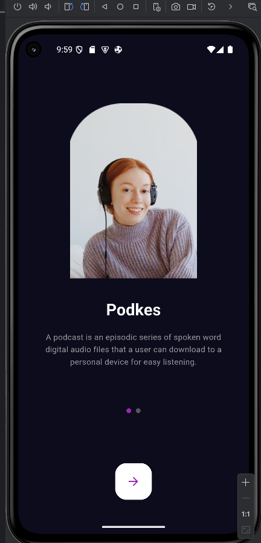
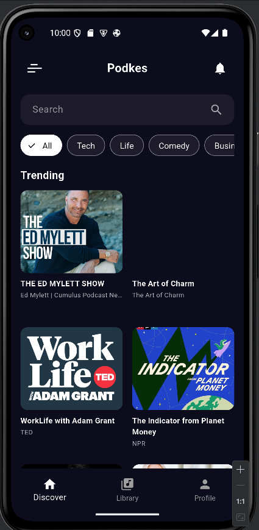
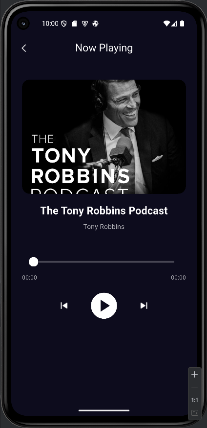

<h1 align="center">🎙️ podkesPiton</h1>
<p align="center">
  <b>A modern and modular podcast streaming app built with Flutter</b><br/>
  <i>Feature-based architecture • Clean Architecture • Cubit State Management</i>
</p>

<p align="center">
  
  
  
  
</p>

---

## ✨ Features

- 🔍 **Explore:** Browse trending podcasts by category
- 🎧 **Now Playing:** Playback controls, skip forward/backward, pause/resume
- 🚀 **Onboarding:** Smooth introduction for new users
- 👤 **Profile:** User info and settings page
- 🧱 **Clean Architecture:** Separated into `data / domain / presentation` layers


---

## 📁 Project Structure

```text
lib/
├── app.dart
├── main.dart
├── core/
│   ├── constants/
│   ├── di/
│   ├── router/
│   └── theme/
├── features/
│   ├── explore/
│   ├── now_playing/
│   ├── profile/
│   └── getting_started/
```

---

## 🧠 Tech Stack & Dependencies

### 🔧 Core Technologies

- **Flutter 3.x** – Cross-platform UI toolkit
- **Dart** – Programming language
- **Cubit (Bloc)** – State management
- **GoRouter** – Declarative routing
- **GetIt** – Dependency injection
- **Equatable** – Value-based equality

### 📦 Notable Dependencies

| Package                   | Purpose                                |
|---------------------------|----------------------------------------|
| `flutter_bloc`            | State management using Cubit/BLoC      |
| `go_router`               | Declarative navigation                 |
| `get_it`                  | Service locator (dependency injection) |
| `equatable`               | Simplifies equality logic              |
| `just_audio`              | Audio playback                         |
| `cached_network_image`    | Efficient image loading & caching      |
| `flutter_svg`             | SVG support                            |

> ℹ️ Full list available in [`pubspec.yaml`](./pubspec.yaml)

---

## 🖼️ Screenshots

|                  Start                   |                    Explore                     |                Now Playing                 |
|:----------------------------------------:|:----------------------------------------------:|:------------------------------------------:|
|  |  |  |

---

## 🚀 Getting Started

To run this app locally:

```bash
git clone https://github.com/ahmetceyl4n/podkesPiton.git
cd podkesPiton
flutter pub get
flutter run
```


